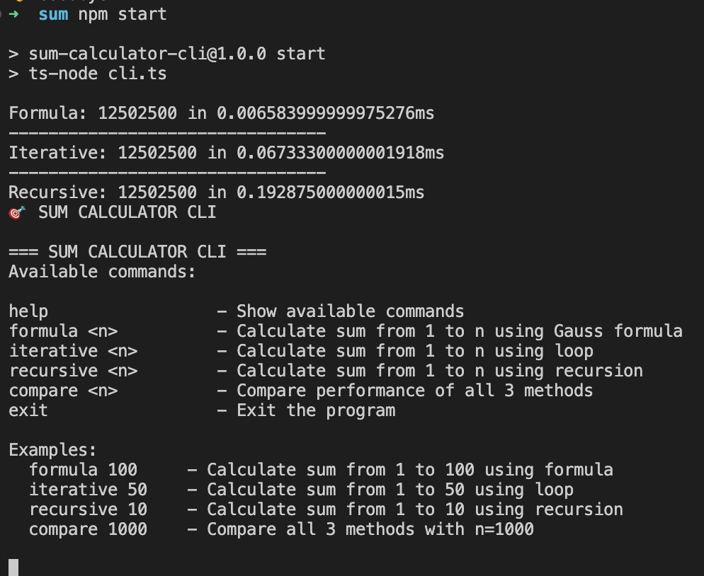
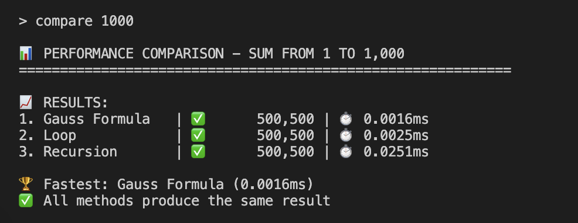

# Sum Calculator

This folder contains three different implementations to calculate the sum of numbers from 1 to n (1 + 2 + ... + n).

## Quick Start

### Option 1: Interactive CLI (Recommended)




```bash
# Install dependencies
npm install

# Start the interactive CLI
npm start
```

The CLI provides several commands:
| Command | Description | Example |
|---------|-------------|---------|
| `help` | Show available commands | `help` |
| `formula <n>` | Calculate sum using Gauss formula | `formula 100` |
| `iterative <n>` | Calculate sum using loop | `iterative 50` |
| `recursive <n>` | Calculate sum using recursion | `recursive 10` |
| `compare <n>` | Compare performance of all methods | `compare 1000` |
| `exit` | Exit the program | `exit` |

Example session:




### Option 2: Direct execution

```bash
# Install ts-node globally if you haven't already
npm install -g ts-node

# Run the TypeScript file
ts-node index.ts
```

Or if you have ts-node installed locally:

```bash
npx ts-node index.ts
```

## Functions

### 1. `sum_to_n_formula(n: number): number`
Uses Gauss' formula to calculate the sum in O(1) time complexity.

**Formula:** `(n * (n + 1)) / 2`

**Implementation:**
```typescript
function sum_to_n_formula(n: number): number {
  return (n * (n + 1)) / 2;
}
```

**How it works:**
Write the sequence forwards and backwards, then add each pair:
```
  (1 + 2 + 3 + ... + n)
+ (n + (n-1) + ... + 2 + 1)
= n pairs, each equal to (n+1)
=> Double sum = n * (n+1)
=> Original sum = (n * (n+1)) / 2
```

**Advantages:**
- Fastest implementation (O(1) time complexity)
- No loops or recursion needed
- Works for any positive integer n

**Example:**
```typescript
sum_to_n_formula(5) // Returns 15 (1 + 2 + 3 + 4 + 5)
```

### 2. `sum_to_n_iterative(n: number): number`
Uses a simple for loop to calculate the sum.

**Complexity:**
- Time: O(n)
- Space: O(1)

**Advantages:**
- Simple and easy to understand
- Memory efficient
- Good for small to medium values of n

**Example:**
```typescript
sum_to_n_iterative(5) // Returns 15 (1 + 2 + 3 + 4 + 5)
```

### 3. `sum_to_n_recursive(n: number): number`
Uses recursion to calculate the sum.

**Complexity:**
- Time: O(n)
- Space: O(n) (due to call stack)

**Advantages:**
- Demonstrates recursive thinking
- Elegant mathematical approach

**Disadvantages:**
- May cause stack overflow for large values of n
- Less efficient than other approaches

**Example:**
```typescript
sum_to_n_recursive(5) // Returns 15 (1 + 2 + 3 + 4 + 5)
```

## Usage

### Programmatic Usage

```typescript
import { sum_to_n_formula, sum_to_n_iterative, sum_to_n_recursive } from './index';

// All functions return the same result
console.log(sum_to_n_formula(10));    // 55
console.log(sum_to_n_iterative(10));  // 55
console.log(sum_to_n_recursive(10));  // 55
```

## Performance Comparison

| Method | Time Complexity | Space Complexity | Best For |
|--------|----------------|------------------|----------|
| Formula | O(1) | O(1) | Large numbers, performance-critical applications |
| Iterative | O(n) | O(1) | Small to medium numbers, readability |
| Recursive | O(n) | O(n) | Educational purposes, small numbers |

## Mathematical Background

The formula-based approach uses Gauss' method:
- Write the sequence forwards: 1 + 2 + 3 + ... + n
- Write it backwards: n + (n-1) + ... + 2 + 1
- Add corresponding terms: (1+n) + (2+(n-1)) + ... + (n+1)
- Each pair equals (n+1), and there are n pairs
- Total: n × (n+1)
- Since we doubled the sum, divide by 2: n × (n+1) / 2
